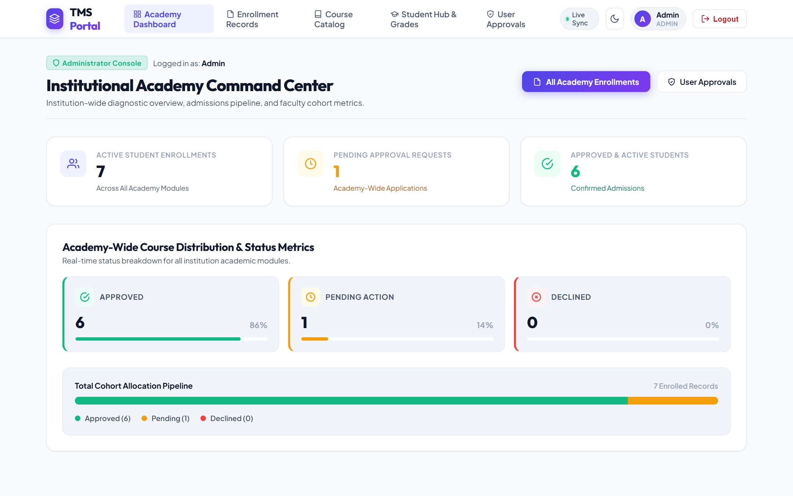
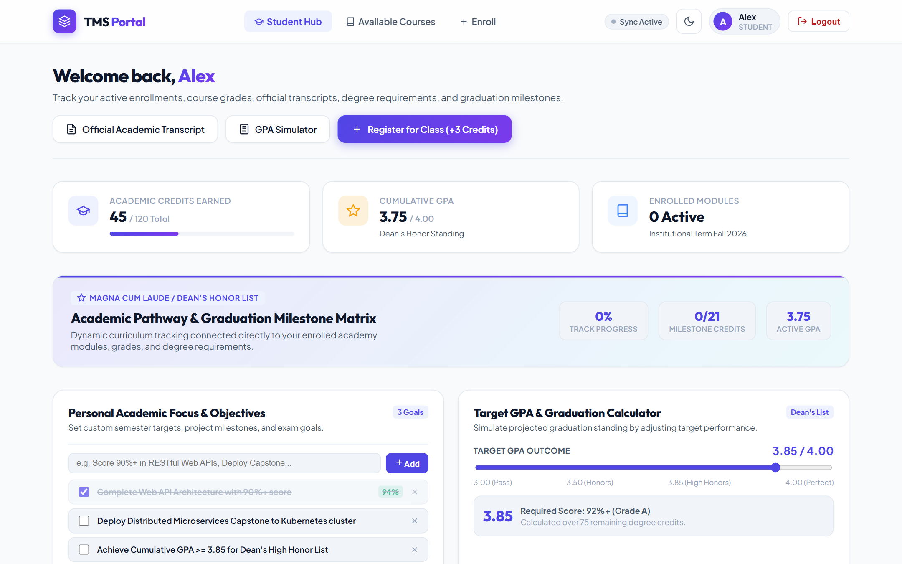

<h1 align="center">⚙️ Training Management System (TMS) — Backend API</h1>

<p align="center">
  <strong>Enterprise Clean Architecture & Real-Time Event-Driven Backend</strong><br>
  Built with .NET 10, ASP.NET Core Web API, Entity Framework Core, MediatR CQRS, SignalR Hubs, FluentValidation, and xUnit.
</p>

<p align="center">
  
  
  
  
  
  
</p>

---

## 🌟 Real System Workflow Showcase

<table>
  <tr>
    <td width="50%" align="center">
      <strong>🛡️ Administrator Operations & Hub</strong><br>
      <em>Academy-wide operations, admissions queue, & real-time telemetry</em><br><br>
      
    </td>
    <td width="50%" align="center">
      <strong>👩‍🏫 Faculty Instructor Command Center</strong><br>
      <em>Real-time enrollment diagnostics, status analytics, & assigned courses</em><br><br>
      
    </td>
  </tr>
  <tr>
    <td width="50%" align="center">
      <strong>👨‍🎓 Student Academic Progress Portal</strong><br>
      <em>Degree milestones, target GPA calculation, & course status</em><br><br>
      
    </td>
    <td width="50%" align="center">
      <strong>📑 Admissions & Enrollments Engine</strong><br>
      <em>One-click decisions, concurrency checks, & instant event broadcast</em><br><br>
      
    </td>
  </tr>
</table>

---

## 📖 Overview

The **TMS Backend API** is an enterprise-grade REST and WebSocket service engineered for institutional learning platforms and training academies.

Adhering strictly to **Uncle Bob's Clean Architecture**, this backend decouples core domain business rules from database technologies, serialization frameworks, and transport channels. Real-time updates (such as admissions decisions and capacity changes) are broadcast to connected clients via **Microsoft SignalR WebSockets**.

---

## 📸 In-Depth Feature Highlights

### 🛡️ 1. Admissions Registry & One-Click Approval Pipeline
> Secure transactional enrollment decisions executed via MediatR Commands with automated validation pipelines, audit logging, and WebSocket broadcast.
<p align="center">
  
</p>

---

### 📚 2. Course Catalog & Real-Time Capacity Tracking
> High-performance course catalog queries with capacity validation guards, instructor assignments, and prerequisite enforcement.
<p align="center">
  
</p>

---

### 🎯 3. Gradebook & Evaluation Engine
> Instructor evaluation endpoint enforcing course ownership, boundary validation rules (0.0 to 4.0), and transcript generation.
<p align="center">
  
</p>

---

### 🔐 4. Identity & JWT Authentication Pipeline
> Dual-mode authentication service with PBKDF2 / Argon2 password hashing, refresh token rotation, and administrative user approval workflows.
<p align="center">
  
</p>

---

## 🏗️ Clean Architecture Structure

```text
TmsApi/
├── TmsApi.Domain/              # Enterprise Core (Entities, Enums, Value Objects, Domain Events)
│   ├── Entities/               # Course, Enrollment, Student, UserAccount, Grade
│   └── Enums/                  # EnrollmentStatus, UserRole, ApprovalStatus
├── TmsApi.Application/         # Use Case Layer (CQRS Commands, Queries, Behaviors)
│   ├── Courses/                # Create, Update, AssignInstructor, GetCatalog
│   ├── Enrollments/            # SubmitEnrollment, ApproveEnrollment, RejectEnrollment
│   ├── Common/Behaviors/       # ValidationBehavior, LoggingBehavior, PerformanceBehavior
│   └── Interfaces/             # ITmsDbContext, ICurrentUserService, ISignalRNotificationService
├── TmsApi.Infrastructure/      # External Concerns (EF Core, Database Migrations, Identity)
│   ├── Data/                   # TmsDbContext, Entity Configurations, Interceptors
│   ├── Identity/               # JwtTokenService, PasswordHasher, IdentitySeeder
│   └── Hubs/                   # LiveSyncHub (SignalR WebSocket notifications)
├── TmsApi.Api/                 # Presentation Layer (Controllers, Middlewares, OpenAPI)
│   ├── Controllers/V1/         # Versioned REST Controllers (Courses, Enrollments, Users)
│   ├── Controllers/V2/         # Next-Gen Versioned API Controllers
│   ├── Middleware/             # Global Exception Handling & Correlation ID
│   └── Program.cs              # DI Composition Root & Kestrel Server Setup
└── TmsApi.Tests/               # Automated Testing Suite (Unit, Integration & CQRS Specs)
```

---

## 🚀 Getting Started

### Prerequisites
- **.NET SDK**: `10.0` or higher
- **IDE**: Visual Studio 2026, VS Code with C# Dev Kit, or JetBrains Rider

### Running the API
```bash
# Clone the repository
git clone https://github.com/Merdikai/TmsApi.git
cd TmsApi/TmsApi

# Restore dependencies
dotnet restore

# Run database migrations & start Kestrel
dotnet run --project TmsApi.Api
```

The API will start at `http://localhost:5282` with interactive Swagger OpenAPI documentation available at:
👉 `http://localhost:5282/swagger`

---

## 🧪 Comprehensive Automated Testing

```bash
# Run all automated test suites (Unit, Architecture & MediatR handlers)
dotnet test --logger "console;verbosity=normal"
```

---

<p align="center">
  Engineered with Clean Architecture principles for the <strong>Training Management System</strong> ecosystem.
</p>
