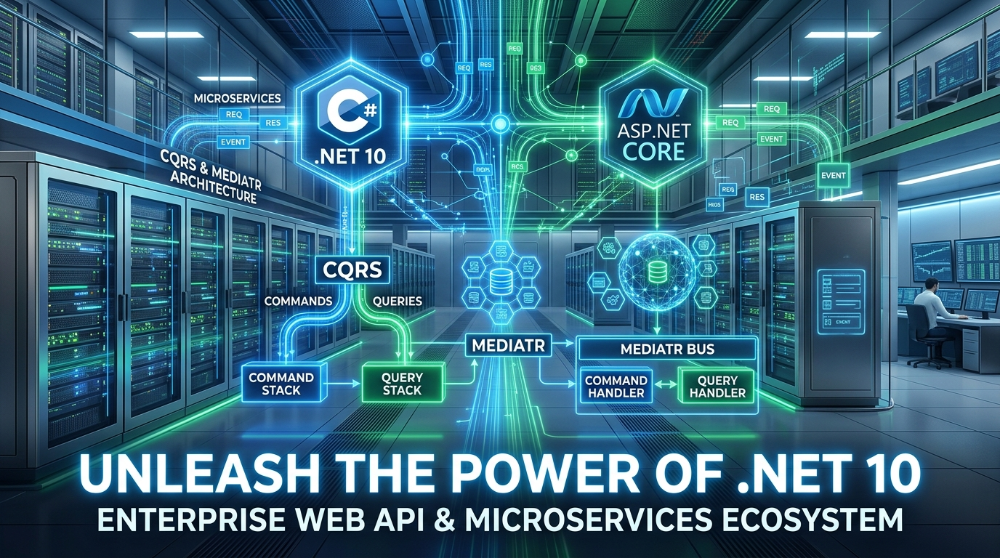
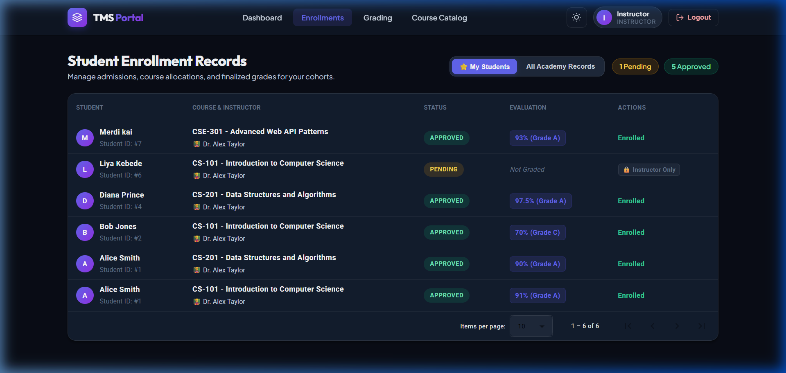
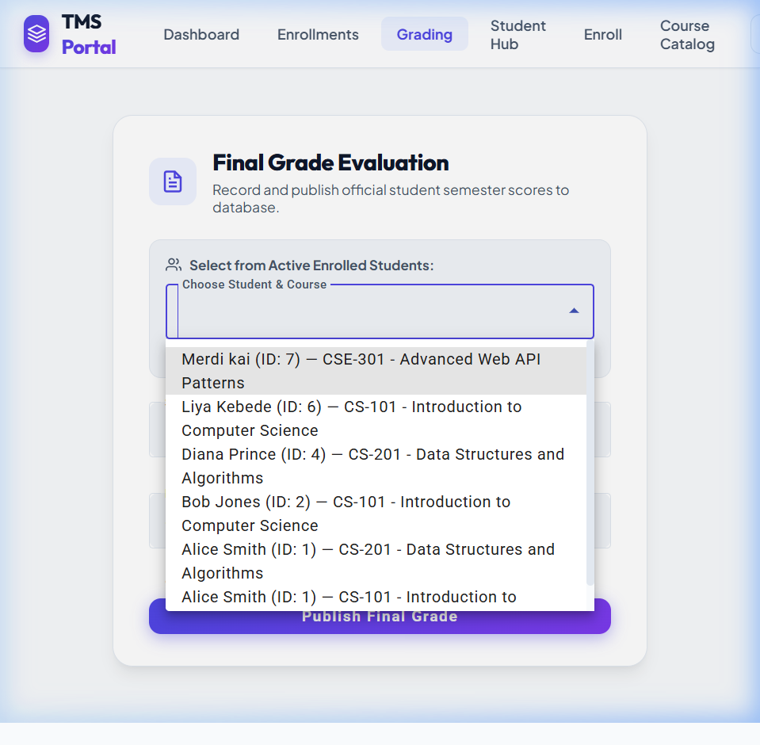

<p align="center">
  
</p>

<h1 align="center">⚡ Training Management System (TMS) — Backend Web API</h1>

<p align="center">
  <strong>High-Performance Enterprise .NET 10 Clean Architecture RESTful & Real-Time API</strong><br>
  Engineered with ASP.NET Core, CQRS & MediatR, Entity Framework Core, SignalR, xUnit, and ProblemDetails.
</p>

<p align="center">
  
  
  
  
  
  
</p>

---

## 🌟 Overview

The **TMS Backend API** is the core transaction, business rule, and data processing engine for the Training Management System. Built upon **Clean Architecture** principles and **Domain-Driven Design (DDD)**, it ensures loose coupling, strict domain invariant protection, and extreme testability.

It powers multi-role access control (Students, Instructors, Administrators), versioned RESTful pipelines, real-time WebSocket notifications via SignalR, distributed caching, and RFC 7807 ProblemDetails compliance.

---

## 📸 Real System Workflow Screenshots

### 📊 1. Admissions & Real-Time Live Sync Dashboard
> Powers the Academy Command Center with live SignalR WebSocket events (`/hubs/tms`), aggregated statistics, and computed enrollment totals.
<p align="center">
  
</p>

---

### 📋 2. Admissions Pipeline & Enrollment State Transactions
> Processes student admission applications, capacity constraints, status transitions (`Pending` ➔ `Approved` / `Rejected`), and CSV reporting.
<p align="center">
  
</p>

---

### 🎓 3. Domain Grade Calculation & Evaluation Engine
> Enforces domain rules via `GradingService` — validates instructor course ownership, converts numeric scores (0-100) to GPA (0.0-4.0) and letter grades (`A`-`F`).
<p align="center">
  
</p>

---

## 🏛️ Clean Architecture Layers

```text
TmsApi.sln
├── TmsApi.Domain/          # Enterprise Business Rules & Entities
│   ├── Entities/           # Course, Student, Enrollment, User Models
│   ├── Exceptions/         # Domain Exceptions & Validation Rules
│   └── ValueObjects/       # Immutable Domain Value Types
│
├── TmsApi.Application/     # Application Logic & Use Cases
│   ├── Commands/           # CQRS Command Handlers (MediatR)
│   ├── Queries/            # CQRS Query Handlers (MediatR)
│   ├── DTOs/               # Data Transfer Objects & Requests
│   ├── Interfaces/         # Service & Repository Abstractions
│   └── Services/           # Domain Logic Services (Grading, Rules)
│
├── TmsApi.Infrastructure/  # Frameworks, Drivers & External Services
│   ├── Persistence/        # EF Core DbContext, Migrations & Configurations
│   ├── Services/           # Caching, SignalR Hubs & External Clients
│   └── Authorization/      # Resource-Based Policies & Requirements
│
├── TmsApi.Api/             # Presentation Layer & HTTP Transport
│   ├── Controllers/V1/     # Version 1.0 Controllers (Baseline REST)
│   ├── Controllers/V2/     # Version 2.0 Controllers (Data Shaping & HATEOAS)
│   ├── Hubs/               # SignalR Real-Time Event Hubs
│   ├── Middleware/         # Global ProblemDetails Exception Handling
│   └── Program.cs          # Dependency Injection & Pipeline Configuration
│
└── TmsApi.Tests/           # Unit & Integration Test Suite
    ├── Unit/               # Business Logic Tests (Grading, Domain Rules)
    ├── Mocks/              # NSubstitute Handler Mock Tests
    └── Integration/        # WebApplicationFactory In-Memory Host Tests
```

---

## 🚀 Key Architectural Capabilities

### 1. 🔄 CQRS & MediatR Decoupled Pipelines
All state mutations (like student enrollments, course modifications, and grade postings) run through **MediatR Commands and Queries**, separating read models from domain write models.

### 2. 🔀 URL Segment & Header API Versioning
Supports simultaneous API versions (`v1` and `v2`) with automatic OpenAPI schema segmentation:
- **`v1.0`**: Standard REST payloads and CRUD operations.
- **`v2.0`**: Advanced **Data Shaping** (`?fields=id,title,maxCapacity`), **HATEOAS hypermedia links**, and **Cache Invalidation**.

### 3. ⚡ Real-Time WebSocket Synchronization
Integrated **SignalR Hub** (`/hubs/tms`) broadcasts live enrollment updates (`ReceiveEnrollmentStatusUpdated`) to connected clients without manual polling.

### 4. 🛡️ RFC 7807 Standard ProblemDetails
Consistent, machine-readable error responses across all validation failures, domain constraints, and 4xx/5xx scenarios.

### 5. 🗄️ In-Memory & Database Adaptability
Configured with PostgreSQL for production workloads, automatic schema updates on startup, and dynamic EF Core In-Memory providers for lightning-fast test execution.

---

## 🧪 Automated Testing Safety Net

The backend includes a comprehensive test suite in `TmsApi.Tests`:

| Test Class | Strategy | What It Verifies |
|---|---|---|
| `GradingServiceTests` | Unit (`[Theory]` & `[Fact]`) | Boundary logic, score scaling, and letter grade mappings. |
| `EnrollStudentHandlerTests` | Mocking (`NSubstitute`) | Handler execution, repository interactions, and domain invariant enforcement. |
| `CoursesApiTests` | Integration (`WebApplicationFactory`) | Real HTTP pipelines, versioning routing, and ProblemDetails validation. |

### Running the Test Suite
```bash
cd TmsApi.Tests
dotnet test
```

---

## 🛠️ Getting Started

### Prerequisites
- **.NET 10 SDK** (or .NET 8 / 9 runtime)
- **PostgreSQL** (or SQLite / In-Memory for testing)

### Build & Run
```bash
# Clone the repository
git clone https://github.com/Merdikai/TmsApi.git
cd TmsApi

# Restore dependencies
dotnet restore

# Build solution
dotnet build

# Run the Web API project
dotnet run --project TmsApi.Api
```

The API will listen at `http://localhost:5282` and serve Swagger documentation at `/swagger`.

---

## 📡 API Endpoint Reference (Summary)

| Method | Endpoint | Description |
|---|---|---|
| `GET` | `/api/v1/courses` | List all courses with pagination |
| `GET` | `/api/v1/courses/{id}` | Get course by ID |
| `POST` | `/api/v1/courses` | Create new course (Admin/Instructor) |
| `PUT` | `/api/v1/courses/{id}` | Update course, curriculum & instructor |
| `DELETE` | `/api/v1/courses/{id}` | Delete unassigned course |
| `GET` | `/api/v2/courses?fields=...` | List courses with data shaping & HATEOAS |
| `GET` | `/api/enrollments` | List all student enrollments |
| `POST` | `/api/enrollments/{id}/approve` | Approve student application |
| `POST` | `/api/enrollments/{id}/reject` | Reject student application |
| `POST` | `/api/grades/submit` | Submit student grade evaluation |
| `WS` | `/hubs/tms` | Real-time SignalR live update hub |

---

<p align="center">
  Engineered with high standards for the <strong>Training Management System</strong> backend architecture.
</p>
